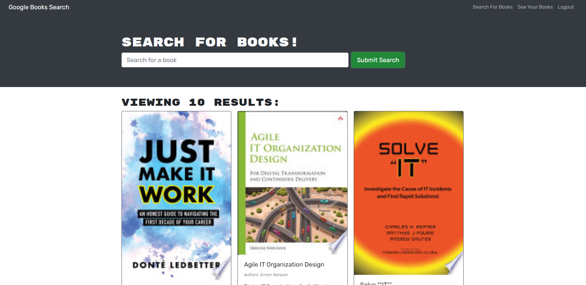

# book-search-engine
GraphQL overhaul of RESTful API
# README Generator

  ## Table of Contents
  
  - [Description](#description)
  - [Usage](#usage)
  - [Questions](#questions)

  ---

  ## Description

  This project is a fullstack application which functions as a Book Search Engine, using the GoogleBooks API. My objective was to take a fully functioning app with a RESTful backend API and convert it to GraphQL.
  The process began with incoporating the Apollo Server, creating TypeDefs for defining our GraphQL schema, and creating Resolvers as routes to access the GraphQL database.
  After the backend was fully converted, I moved on to converting the front end fetch calls to GraphQL queries/mutations.

  The app is deployed live here: https://limitless-lowlands-58198.herokuapp.com/

  ---

  ## Usage

  User have the ability to:  

  - Create an Account
  - Login to their Account
  - Search Books 
  - Add/Delete books from their personal reading list

  
   

  ---

  ## Questions
  Have any questions? Feel free to check out my github or send me an Email!

  github.com/jacobmabob  
  thejacobmccarthy@gmail.com

